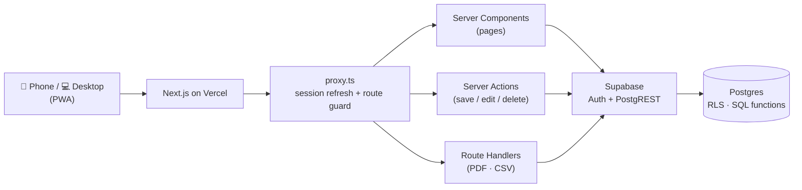

<div align="center">


# MoneyFollows

**Follow your money.** · *Know where your money goes.*

A mobile-first personal finance app for students and young professionals —
record an expense in **5 seconds**, then actually understand where your money goes.

[**Live app →**](https://money-follows.vercel.app)


</div>

---

## ✨ What it does

| | |
|---|---|
| ⚡ **5-second entry** | Tap **+** → `250` → Food → Lunch → Save. Or just type `250 food lunch`. |
| 🏠 **Home at a glance** | Income, spent, invested, remaining — plus today's spending. |
| 🔍 **History** | Search ("movie"), filter by date / category / amount, with totals. |
| 📊 **Analysis** | Category breakdown, drill-down (Food → Lunch → entries), trends, calendar heatmap, insights like *"Food is up ₹1,400 vs last month"*. |
| 👨‍👩‍👧 **Family support** | A first-class category — see exactly what you send home. |
| 🎯 **Plan & save** | Budgets with 80% warnings, savings goals, SIPs & investments, recurring rent/Netflix, purchases. |
| 🧾 **Reports** | Monthly review, a designed **PDF report**, and **CSV export**. |
| 📱 **Installable** | Works as a PWA — add to home screen, no app store. |

## 🛠 Tech stack — what's used for what

| Layer | Tech | Why |
|---|---|---|
| Framework | **Next.js 16** (App Router) + **React 19** + **TypeScript** | Server Components for fast pages, Server Actions for saving data |
| UI | **Tailwind CSS v4**, **shadcn/ui** (Radix), **Lucide** icons | Custom coral design system, accessible components |
| Database | **Supabase Postgres** | Tables, SQL functions for totals & search, indexes |
| Auth | **Supabase Auth** (`@supabase/ssr`) | Email + password, email confirmation, password reset |
| Security | **Row Level Security** + composite foreign keys | Every user can only ever see their own data |
| Validation | **Zod** | Every input checked on the server |
| Charts | **Recharts** (lazy-loaded) | Trends & comparisons without slowing first load |
| PDF | **@react-pdf/renderer** | Branded report generated on the server |
| Testing | **Node test runner** + **PGlite** (Postgres in WASM) | Unit tests + real SQL/RLS tests without Docker |
| Hosting | **Vercel** (free tier) | Serverless, auto-deploy on every push |

## 🏗 Architecture

Serverless — no always-running backend. Each request runs as the signed-in user, and Postgres enforces who can see what.



- **Reads** → Server Components call SQL functions (`find_transactions`, `category_totals`, …), so totals are computed in the database, not in the browser.
- **Writes** → Server Actions, validated with Zod; the user ID always comes from the session, never from the client.
- **Money math** → pure, tested functions in `lib/calculations` (savings rate, budget usage, comparisons, plan allocation).

```
app/            pages: (auth), (app) — home, history, analysis, budgets, goals, reports…
components/     UI, charts, transaction sheet, brand
lib/            actions · data · calculations · parsers · validations · pdf
database/       SQL migrations (schema, RLS, analytics)
scripts/        migrate, tests, icon generator
```

## 🚀 Run locally

```bash
npm install
cp .env.example .env.local      # add your Supabase URL + publishable key
npm run db:bundle               # → paste database/supabase-setup.sql into Supabase SQL Editor
npm run dev
```

```bash
npm run check     # typecheck + lint + build
npm test          # unit tests
npm run db:test   # migrations + RLS + SQL tests on in-memory Postgres
```

## 👤 Author

Designed and built by **[Vishvajit Jadhav](https://github.com/Vishvajitjadhav)** — product idea, branding, UI and full-stack implementation.

<sub>MoneyFollows is a personal-finance tracker, not financial advice.</sub>
